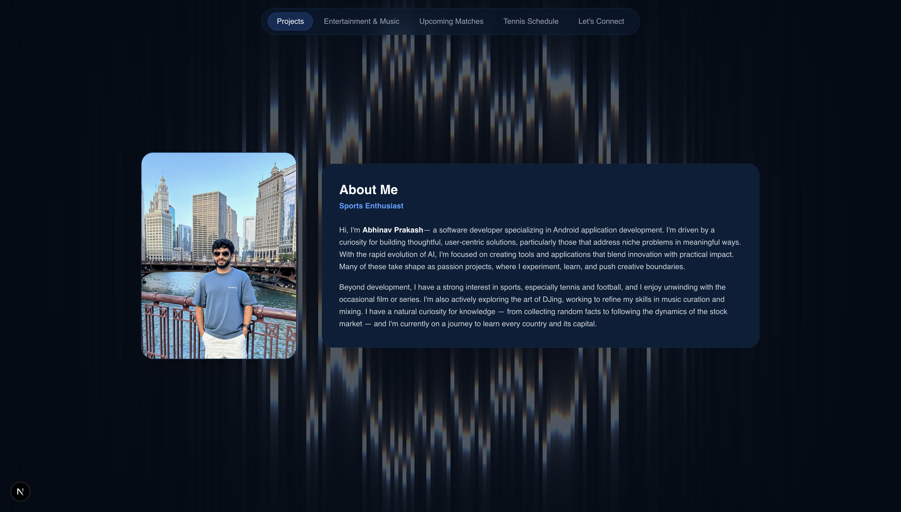

# Abhinav P — Personal Website



A personal website built with Next.js, Tailwind CSS, and Firebase. Live at [abhinavp403.github.io](https://abhinavp403.github.io).

## Sections

**Projects** — Showcases apps and projects made using AI with demo videos, GitHub links, and download buttons where applicable. These projects are made from my interests with the hopes of solving niche, everyday problems with simple well-architected solutions with seamless and feasible UX.

**Entertainment & Music** — Displays my favourite movies and TV shows that I've been watching in the current year as an animated poster grid. Below that, I've linked my live Spotify data to show my top artists and top tracks with album art that I'm currently listening to.

**Upcoming Matches** — Shows the next fixture for my favourite teams and players across various soccer leagues (EPL, LaLiga, MLS), NBA, NFL, Formula 1, and tennis. Completed games are automatically skipped so the card always shows the next unplayed match.

**Tennis Schedule** — Lists ATP and WTA tournaments for the current month, grouped so shared events show a single card. Cards have surface-specific backdrop images (clay/grass/hard/indoor-hard) matched to tournament tier (Grand Slam, 1000, 500, 250). Filter by All / ATP / WTA.

**Word of the Day** — Displays a daily word with its definition (retrieved from Dictionary.com API).

**Links** — Quick-access links to my social profiles and other pages.

## Tech Stack

- **Framework:** Next.js 16 (App Router)
- **Styling:** Tailwind CSS v4
- **Animations:** Framer Motion
- **Database:** Firebase Firestore (movies/shows data)
- **APIs:** ESPN (sports fixtures + tennis schedule), Spotify, Dictionary API
- **Language:** TypeScript

## Deployment

Deployed on **Heroku** using the [heroku/nodejs](https://devcenter.heroku.com/articles/nodejs-support) buildpack. The app runs as a standard Next.js server (`npm start`) on Heroku's dynos. Environment variables (Spotify, Firebase, etc.) are configured via Heroku Config Vars in the dashboard rather than a `.env` file.

## Running Locally

```bash
npm install
npm run dev
```

Open [http://localhost:3000](http://localhost:3000).
